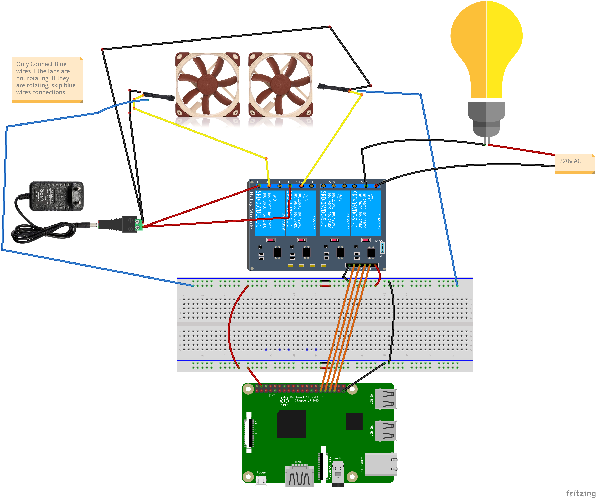
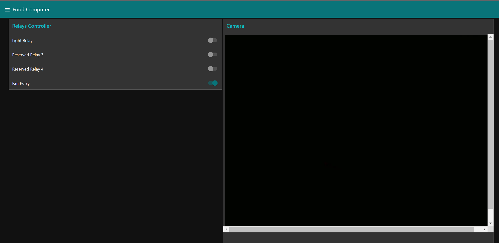
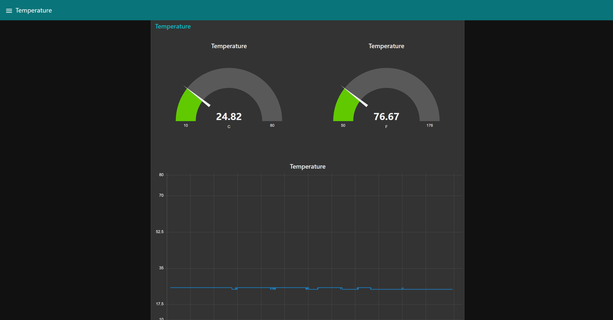
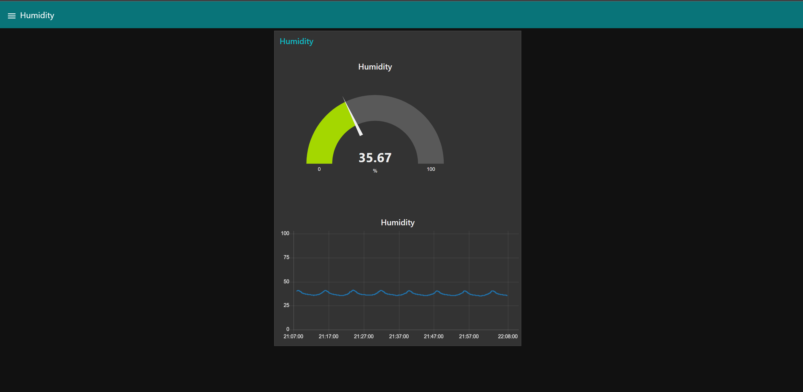
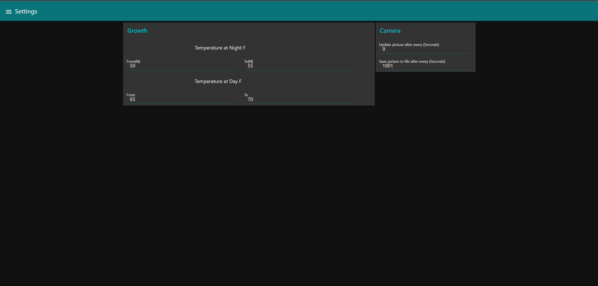
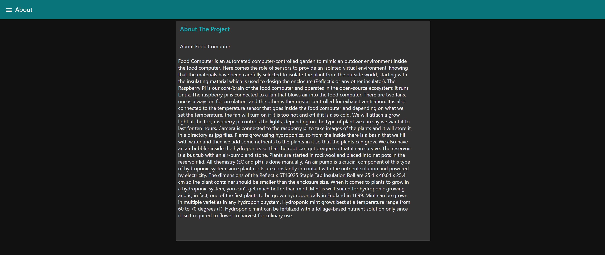

<p align="center">
  <a href="" rel="noopener">
 </a>
</p>

<h3 align="center">Food Computer</h3>

<div align="center">

[]()


</div>

---


<p align="center"> Food Computer
    <br> 
</p>

## 📝 Table of Contents

- [About](#about)
- [Getting Started](#getting_started)
- [Prerequisites](#deployment)
- [Installation and Config](#Installation_and_Config)
- [Test](#test)
- [Circuit](#circuit)
- [Dashboard](#dashboard)
- [Built Using](#built_using)
- [Authors](#authors)

## 🧐 About <a name = "about"></a>

This repo contains circuit, firmware and backend for Food Computer Project.

## 🏁 Getting Started <a name = "getting_started"></a>

These instructions will get you a copy of the project up and running on your local machine for development and testing purposes. See [deployment](#deployment) for notes on how to deploy the project on a live system.

### Prerequisites <a name = "Prerequisites"></a>

What things you need to install the software and how to install them.

```
- Raspberry Pi Model 3B, 3B+, 4B or CM4
```

## Installation and Configuration <a name = "Installation_and_Config"></a>

A step by step series that covers how to get the Firmware running.

### Raspberry Pi Firmware Pre-Reqs

1.  Download and install the latest Raspberry Pi OS Desktop image to your SD card
2.  Open the terminal and execute the following command
    ```sudo raspi-config```
3. Then follow the following pictures to enable I2C bus on you raspberry pi

* 
* 
* 
* 
* 

* Then do the same for Serial(UART)

* 

* And same for SPI, SSH and Camera

### Configuring Raspberry Pi and Running the UI
  1.  Copy FirmwareRPi folder to the desktop of your Raspberry Pi, open the terminal of your Raspberry Pi and execute the following commands

```bash
  - sudo apt-get update
  - sudo apt-get upgrade
  - sudo apt install python3-pip
  - pip3 install paho-mqtt
  - sudo adduser $USER dialout
  - sudo cp siSensor.service /lib/systemd/system/
  
```

Once done, import `flows.json` to the nodered, form `dashboard` folder.
### Installing and Configuring Node-RED on Raspberry Pi

Conifguring NodeRED, MQTT is required only one time.

Open the terminal and execute the following commands

```
- sudo apt install ufw
- sudo ufw enable
- sudo ufw allow tcp http https 1883 8883 1880 80 8080 443
```
##### Installing MQTT(Mosquitto)
Open the terminal and execute the following commands

```
- sudo apt install -y mosquitto mosquitto-clients
- sudo systemctl enable mosquitto.service
- mosquitto -v
```
##### Installing and Configuring NodeRED
Open the terminal and execute the following commands

```
- bash <(curl -sL https://raw.githubusercontent.com/node-red/linux-installers/master/deb/update-nodejs-and-nodered)
- sudo systemctl enable nodered.service
- npm install node-red-dashboard 
- sudo npm install node-red-dashboard
- sudo systemctl restart nodered.service
```
Then open NodeRED in your raspberry pi or using any other device which is connected to the same network
as your Raspberry Pi is.
In the browser you can type http://raspberrypi.local:1880 to open the node-red

- Once node-red is opened, click on the menu button on the top left corner of the app and click on import.
- Click on `select file to import` and select flows.json present in the `dashboard` directory of this repo.
- After flows are imported, click on Deploy button on the top of the screen to save the changes.
- You can access the Dashboard using http://raspberrypi.local:1880/ui


1.  To run the program just restart the raspberry pi.

This program make use of MQTT to communicate with the webapp.

  ```diff
  + broker used is mosquitto, deployed on the Raspberry Pi.
  + vending can be done by publishing an ammount to mdb/invoke topic
  ```


## ⛏️ Testing <a name = "test"></a>

1.  The Firmware can be tested on Raspberry Pi 3B, 3B+ or 4B with the following modifications
  1.  Connect the sensor as shown in the Circuit Diagram section below.

## 🔌 Circuit Diagram <a name = "circuit"></a>




* RPi 3,4 GPIOs Pinout


### Circuit


```http
Pins connections
```

| Si7021 | Raspberry Pi |
| :--- | :--- |
| `SDA` | `3` | 
| `GND` | `GND` |
| `3V3` | `3V3` | 
| `SCL` | `5` | 

| Relay Pins | Raspberry Pi |
| :--- | :--- |
| `VCC` | `5V` | 
| `GND` | `GND` | 
| `P1` | `29` | 
| `P2` | `31` | 
| `P2` | `33` | 
| `P2` | `35` | 


## Dashboard <a name = "dashboard"></a>

You can use the dashboard with the link below:

[https://maggoty-seaurchin-3431.dataplicity.io/ui](https://maggoty-seaurchin-3431.dataplicity.io/ui)



  ```diff
  - The dashboard is running on Raspberry Pi. 
  ```

  
  
  
  
  


## Components Used

1.  [Raspberry Pi](https://www.amazon.com/CanaKit-Raspberry-Micro-Supply-Listed/dp/B01C6FFNY4/ref=sr_1_1?dchild=1&keywords=raspberry+pi+3&qid=1632029848&sr=8-1)
2. USB WebCam
3. Si7021 Temperature and Humidity Sensor
4. 4 Channel Relay Module
5. Fan
6. Lights

## ⛏️ Built Using <a name = "built_using"></a>

- [Python3](https://www.python.org/) - Raspberry Pi FW
- [Node-RED](https://nodered.org/) - Platform for creating dashbaords and backend logic
- Bash

## ✍️ Authors <a name = "authors"></a>

- [@Nauman3S](https://github.com/Nauman3S) - Development and Deployment
